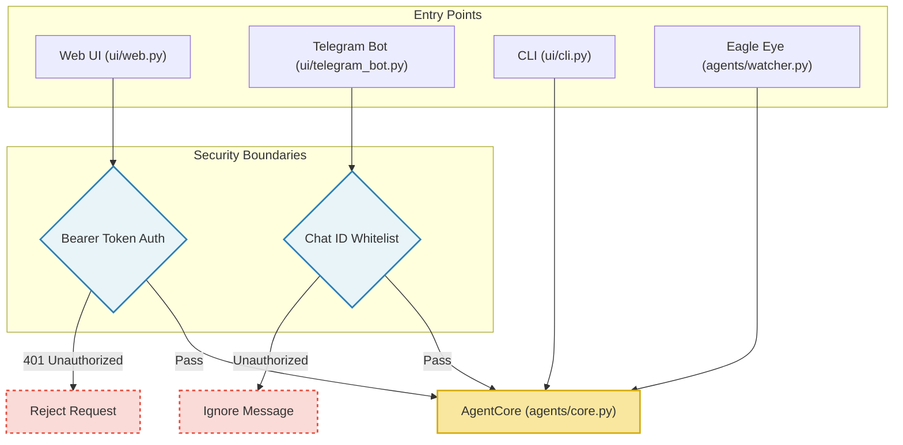
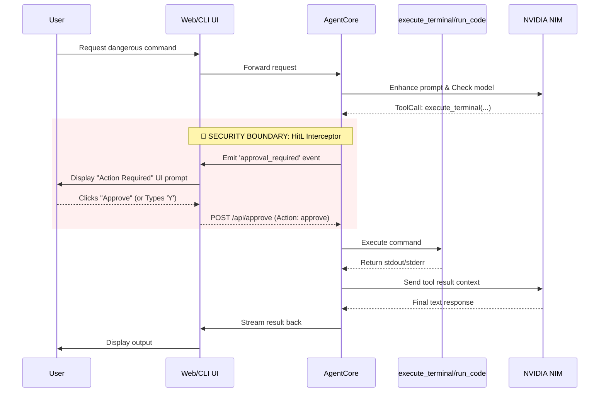

# 🗺 MRAgent — Connection Architecture & Security Map

> **Version:** 0.1.1 | **Created:** 2026-02-20 | **Status:** Live
> **Goal:** Document the exact connections between features, which files handle them, and their specific security boundaries so developers can safely contribute without introducing vulnerabilities.

---

## 1. System Overview & Entry Points

MRAgent has three primary interfaces and one background watcher. All route back to the central `AgentCore`.

### 1.1 Web Interface (`ui/web.py`)

- **Connection**: Exposes APIs (`/api/chat`, `/api/models`) and Server-Sent Events (SSE) for streaming UI.
- **Security Boundary**:
  - Protected by a **Bearer Token** (`MRAGENT_ACCESS_TOKEN`).
  - `@require_auth` decorates all `/api/*` endpoints. If the token is missing or incorrect, it returns a `401 Unauthorized` and renders a full-screen lock overlay.
  - **Data Isolation**: SSE streams use a global `_event_queues` dictionary mapped by session `chat_id`. This prevents cross-user data leakage where one user's streaming output might accidentally be sent to another user's browser.

### 1.2 Telegram Bot (`ui/telegram_bot.py`)

- **Connection**: Uses `python-telegram-bot` to poll for messages. Translates Telegram voice/text into `AgentCore` queries.
- **Security Boundary**:
  - Protected by a **Chat ID Whitelist**.
  - Checks every incoming message against `ALLOWED_TELEGRAM_CHATS` in the environment. If the sender's ID is not listed, the bot rejects the message with an "Unauthorized" warning.

### 1.3 Command Line Interface (`ui/cli.py`)

- **Connection**: Uses `prompt_toolkit` and `rich` for an interactive terminal experience. Directly instantiates `AgentCore`.
- **Security Boundary**:
  - Local terminal instance assumes the user has physical or SSH access, but still implements Human-in-the-Loop (HitL) execution (see Section 3.1).

### 1.4 Eagle Eye Watcher (`agents/watcher.py`)

- **Connection**: A background script that runs an infinite loop using `tools/screen.py` to diff screenshots. If substantial changes occur, it invokes the VLM (Vision Language Model) `llama-3.2-11b-vision` via `providers/nvidia_llm.py` and speaks the result via `providers/tts.py`.
- **Security Boundary**: No inbound network access. It acts purely as a local observer.

---

## 2. Core Brain (`agents/core.py`)

The `AgentCore` class is the central nervous system. All interfaces send user messages here, and it orchestrates the LLMs and Tools.

- **ReAct Loop**: Enhances the user prompt (`agents/prompt_enhancer.py`), checks memory (`memory/chat_store.py` / `agents/context_manager.py`), selects a model (`agents/model_selector.py` & `config/settings.py`), and asks the LLM for a response or a tool call list.
- **Tool Interceptor**: `_execute_tool_calls()` is responsible for executing what the LLM requests.
  - **Security Boundary**: This is where the **Human-in-the-Loop (HitL)** architecture intercepts. See below.

---

## 3. Tool Execution & Security Boundaries

Tools are located in `tools/` and are registered in `tools/base.py`. They represent the agent's ability to mutate the system.

### 3.1 Remote Code Execution (RCE) Tools

- **Files**: `tools/terminal.py` (Shell) and `tools/code_runner.py` (Python/JS sandbox).
- **Functionality**: Execute arbitrary commands on the host OS.
- **Security Boundary (HitL)**:
  - Docker sandboxing is omitted for low-resource efficiency. Instead, the agent relies on an **Approval Callback**.
  - In `agents/core.py`, when `execute_terminal` or `run_code` are requested, the agent pauses the execution thread and emits an `approval_required` event to the `approval_callback` function provided by the UI.
  - **Web UI (`ui/web.py`)**: The `/api/approve` REST endpoint acts as a manual semaphore. The UI displays an "Action Required" card. The execution thread is blocked until the user clicks Approve/Reject.
  - **CLI (`ui/cli.py`)**: Pauses the terminal and asks for `[y/N]` input via `rich.prompt.Confirm`.

### 3.2 File Management Tool

- **File**: `tools/file_manager.py`
- **Functionality**: Read, write, list directories, and move files.
- **Security Boundary**:
  - **Path Traversal / Key Extraction Prevention**: The agent cannot read `.env` (containing API keys) or `mragent.json` (containing system configuration). Attempts to target these files are explicitly hard-blocked inside the `ReadFileTool` and `WriteFileTool` `execute()` methods, returning an "Access Denied: Cannot read system configuration file" error back to the LLM.
  - **Resource Exhaustion**: `ReadFileTool` respects a `MAX_READ_SIZE` (~100KB) to prevent loading massive log or media files into the LLM context and crashing the process.

---

## 4. Providers & Downstream APIs

The agent communicates with NVIDIA APIs and search engines via `providers/`.

- **LLM / VLM API (`providers/nvidia_llm.py`)**: Uses the OpenAI SDK to communicate with NVIDIA NIMs. The `MODEL_REGISTRY` in `config/settings.py` controls which models (`llm` or `vlm`) are selectable and which environment variables their keys correspond to.
- **Security Boundary**: API keys are loaded directly from `.env` by `config/settings.py`. They are never stored in the database or sent over the Web UI.

---

## 5. Security Summary Matrix

| Threat Vector                    | Affected Component     | Implemented Defense                        | File Location                              |
| -------------------------------- | ---------------------- | ------------------------------------------ | ------------------------------------------ |
| **Unauthorized Web Access**      | Web UI / Flask         | Bearer Token `/api/login` auth wall        | `ui/web.py`                                |
| **Cross-User Data Leakage**      | Web UI / SSE Streams   | Scoped `_event_queues` per session ID      | `ui/web.py`                                |
| **Unauthorized Telegram Access** | Telegram Bot           | Chat ID Whitelist validation               | `ui/telegram_bot.py`                       |
| **Silent RCE / Malicious Shell** | Terminal / Code Runner | Human-in-the-Loop thread blocking          | `agents/core.py`, `ui/web.py`, `ui/cli.py` |
| **API Key Theft via File Read**  | File Manager           | Hard-blocked `.env` / `mragent.json` scope | `tools/file_manager.py`                    |
